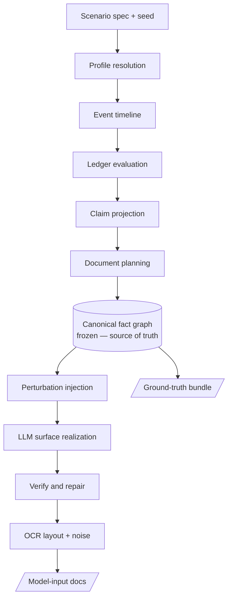

# CLAUDE.md — Synthetic Source-of-Wealth (SoW) Data Generator

> Read this file first. It is the single orientation point for the project. Deep
> detail lives in `docs/`; this file stays concise and is loaded every session.

## What this project is

A pipeline that generates **synthetic source-of-wealth case files** to develop and
evaluate SoW analysis agents. Each generated sample contains three things plus a
ground-truth layer:

1. A **client history document** — an OCR-like JSON, a few pages long, that embeds
   claims about how the client built their wealth plus other detail (outflows, net
   worth, etc.).
2. A set of **claims** about the client's source of wealth, each linked to the
   documents that should corroborate it.
3. **Corroboration documents** — also OCR-like JSONs, possibly multi-page (payslips,
   contracts, wills, share-purchase agreements, bank statements, …).
4. **Ground truth** — the structured facts and the claim↔document mapping, so the
   data can be used to score agents.

The hard requirement: documents must be **realistic AND internally consistent**, and
the ground truth must be **trustworthy**. We must never produce a case where the
numbers don't add up (e.g. "inherited 10M, no other flows, net worth 2M").

## The agent we are generating data for

The SoW agent under evaluation must:

1. **Extract** each claim from the client history document.
2. **Classify** each claim into one of four SoW types: `employment`, `gift`,
   `inheritance`, `business_profits`.
3. **Find** the corroboration document(s) that support each claim.
4. **Flag for human review** any claim that is not sufficiently corroborated.

See `docs/ground-truth-and-eval.md` for how each sub-task maps to the data model.

## The one core principle (do not violate)

**Code owns all truth; the LLM only does surface realization.**

Every number, date, and linkage originates in a code-controlled fact layer. Documents
are *renderings* of that fact layer. The LLM turns structured facts into natural prose
and layout — it never *decides* an amount, a date, or which document supports which
claim. This is what makes "realistic" and "correct ground truth" achievable at once
instead of a constant validation battle.

Concrete rules this implies:
- Net worth is **computed** from a ledger of dated events, never sampled and back-solved.
- Every figure that appears in a rendered document must trace to a fact-layer value;
  after rendering, we extract figures and assert membership (verify-and-repair).
- The claim↔document mapping is recorded **by construction** when a document is
  planned from a known event — never reconstructed later.
- OCR noise is added **programmatically**, never by asking an LLM to "add noise"
  (that silently corrupts ground truth). Always keep the clean copy.

## Architecture at a glance

Deterministic, code-owned stages build up to a frozen canonical fact graph; the LLM
only enters at the rendering stage. Full detail in `docs/architecture.md`.



Everything from `spec` to the graph is deterministic and LLM-free. `sr` (surface
realization) is the only stage where the LLM runs, and it is constrained to
schema-valid output with numbers injected from the graph.

## Data model summary

Nodes: `Profile`, `Event` (typed, dated), `Claim` (typed, amount, provenance),
`Document` (typed, multi-page, OCR-like). Edges:

| Edge | Connects | Meaning | Seen by agent? |
|------|----------|---------|----------------|
| `states` | ClientHistory → Claim | the history asserts this claim (extraction target) | yes (as text to extract) |
| `covers` | Claim → Event(s) | claim accounts for these inflow events (accounting) | no — scaffolding |
| `corroborates` | Document → Claim | document provides external evidence (the key mapping) | yes (recovery target) |
| `derived_from` | Document/artifact → Facts | generation lineage (how it was made) | no — scaffolding |

In clean data, `corroborates` is *implied* by `derived_from` + `covers`. It is stored
explicitly and mutably so perturbations can break it (drop it → flag case; relabel as
contradictory → contradiction case). Full detail in `docs/data-model.md`.

## Tech stack & conventions

- **Pydantic v2** — every schema and the entire fact layer. The spine of the project.
- **NetworkX** — the canonical fact graph (compatible with prior `sow_reconcile` work).
- **Jinja2** — document structure templates; numbers injected programmatically.
- **Structured outputs / constrained decoding** — Azure OpenAI structured outputs
  (or `instructor` / `outlines`) for every LLM call, so the model returns validated
  schemas, never free text to be parsed.
- **Hamilton** (or a plain typed functional module structure to start) — pipeline as
  pure, testable, lineage-tracked functions.
- **Hypothesis** — property-based tests on the *generators*, asserting invariants
  (see below) across thousands of seeds.
- **Azure OpenAI** for LLM calls.
- OCR output schema target: **TBD — likely Azure Document Intelligence**. Confirm
  before building the OCR-rendering stage (see `docs/open-questions.md`).

Invariants that must always hold (enforce with Hypothesis):
- The ledger identity `net_worth = Σ inflows − Σ outflows` holds for every sample.
- Every figure in every *clean* rendered document traces to an `Event` or ledger value.
- Every `Claim.amount` equals the sum of the amounts of the events it `covers`.
- Reproducibility: `(spec, seed)` fully determines the sample, bit-for-bit.

## Proposed repository structure

```
.
├── CLAUDE.md
├── README.md
├── docs/
│   ├── architecture.md
│   ├── data-model.md
│   ├── ground-truth-and-eval.md
│   ├── roadmap.md
│   └── open-questions.md
├── sow_synth/
│   ├── spec.py            # ScenarioSpec + sampling of specs
│   ├── profile.py         # Stage 1: profile resolution/enrichment
│   ├── events.py          # Stage 2: typed dated event generation
│   ├── ledger.py          # Stage 3: deterministic fold → net worth
│   ├── claims.py          # Stage 4: claim projections over events
│   ├── docplan.py         # Stage 5: document requirements matrix
│   ├── graph.py           # Stage 6: assemble + freeze canonical graph
│   ├── perturb.py         # Stage 7: labeled difficulty injection
│   ├── render/            # Stage 8: templates + LLM surface realization
│   │   ├── templates/     # Jinja2 templates per document type
│   │   └── realize.py
│   ├── verify.py          # Stage 9: extract figures, assert, repair
│   ├── ocr.py             # Stage 10: OCR schema emit + programmatic noise
│   ├── package.py         # Stage 11: bundle sample (input + clean + GT)
│   └── models.py          # Pydantic v2 schemas for all nodes/edges/docs
├── tests/                 # Hypothesis property tests + unit tests
└── eval/                  # Harness that consumes ground-truth bundles
```

## Current status & what to build first

**Status:** design complete, no code yet. This package captures all decisions from the
design conversation.

**Build order** (full version in `docs/roadmap.md`):
1. **Fact core first.** Implement `models.py`, `events.py`, `ledger.py`, `graph.py`
   with Hypothesis tests proving the invariants. This yields trustworthy ground truth
   with *no documents* — the highest-risk part validated before any rendering.
2. **One document type end-to-end** through `docplan` → `render` → `verify` → `ocr`,
   to validate the render-verify-noise loop on a single payslip-style doc.
3. **Scale out** to the full document matrix and the perturbation taxonomy.
4. **Packaging + eval harness.**

## Decision-blocking open questions

Resolve these before generating at scale; they silently re-label data if changed late.
Detail and recommended defaults in `docs/open-questions.md`.

1. **Sufficiency rule** — exact definition of "sufficiently corroborated" (full vs.
   partial coverage; how one contradictory doc affects a claim; temporal validity).
2. **Target OCR schema** — which engine's JSON format to emit.
3. **Currency** — single vs. multi-currency (multi needs FX dates in the ledger).
4. **Extraction scoring** — exact match vs. span overlap; amount tolerance.
5. **Scale & LLM-call budget per sample** — drives how much we template vs. generate.
