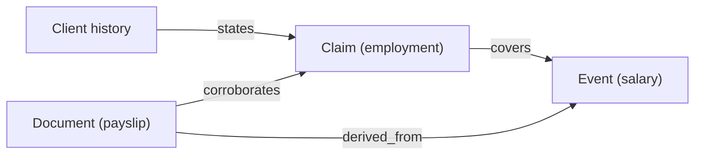

# Data model

All schemas are **Pydantic v2**. The fact layer is a typed graph (NetworkX) assembled
in stage 6 and frozen. The sketches below are illustrative, not final.

## Node types

### Profile
Enriched client identity. Drives what wealth stories are credible.

```python
class Profile(BaseModel):
    client_id: str
    name: str
    date_of_birth: date
    occupation: str
    nationality: str
    domicile: str          # jurisdiction → tax, inheritance law, doc types, currency
    industry: str | None = None
    # derived
    age: int
    plausible_career_start: date
```

### Event (typed, dated) — the backbone of truth
Every financial fact is a dated, typed event. Net worth is computed from these.

Inflow types: `employment_income` (per role-year), `inheritance`, `gift_received`,
`business_profit_distribution`, `investment_gain`.
Outflow types: `property_purchase`, `tax`, `gift_given`, `living_expense`,
`investment_loss`.

```python
class Event(BaseModel):
    event_id: str
    type: EventType            # enum of the above
    direction: Literal["inflow", "outflow"]
    date: date
    amount: Decimal            # in the sample's base currency
    currency: str
    sow_type: SowType | None   # for inflows: employment|gift|inheritance|business_profits
    meta: dict                 # role, counterparty, asset ref, etc.
```

Constraints enforced in code: causal ordering (no `business_profit_distribution`
before the company is founded; no `property_purchase` without prior liquidity);
realistic magnitudes (log-normal for incomes/wealth); tax derived from inflows.

### Claim (typed, with provenance)
A claim is a **projection over a subset of events** — never an independently sampled
number.

```python
class Claim(BaseModel):
    claim_id: str
    sow_type: SowType          # employment|gift|inheritance|business_profits
    amount: Decimal            # == sum of amounts of covered events (invariant)
    covered_event_ids: list[str]
    asserted_text: str | None  # how it reads in the client history (extraction target)
```

### Document (typed, multi-page, OCR-like)
Generated artifacts. Two roles: the single **client history** document, and the
**corroboration** documents.

```python
class Document(BaseModel):
    doc_id: str
    doc_type: DocType
    role: Literal["client_history", "corroboration"]
    pages: list[OcrPage]       # clean rendered content (see OCR schema below)
```

`DocType` covers 16 implemented format types across four categories:

| Category | DocType values |
|----------|---------------|
| Structured | `payslip`, `bank_statement`, `bank_transfer_confirmation`, `company_accounts`, `distribution_statement`, `probate_grant` |
| Legal | `will_extract`, `gift_deed`, `share_purchase_agreement`, `employment_contract` |
| Correspondence | `employer_letter`, `solicitor_letter`, `email_thread`, `gift_letter` |
| Press | `bloomberg_article`, `companies_house_filing` |

### DocumentPlan (Stage 5 blueprint)
One `DocumentPlan` is created per `Claim` in Stage 5 (before graph freeze). It carries
the template context (all fact-layer values), the `corroborates_claim_ids` mapping, and
`verify_hints` for Stage 9.

```python
@dataclass
class DocumentPlan:
    doc_id: str
    doc_type: DocType
    role: Literal["corroboration"]
    source_event_ids: list[str]       # → derived_from edges
    corroborates_claim_ids: list[str] # → corroborates edges
    template_context: dict            # fact-layer values for Jinja2 templates
    verify_hints: list[dict]          # [{key, expected, precision}] for verify.py
```

### Format system
Document format selection is two-dimensional: **SowType** (what fact is being
corroborated) × **FormatType** (how the document looks). A weighted registry
(`formats/registry.py`) maps each `SowType` to a probability distribution over
compatible format types, so different seeds produce different document types for the
same claim — adding realistic variety without breaking the ground-truth invariants.

`PrecisionMode` controls how `verify.py` compares rendered amounts to expected values:
- `exact` — must match to the penny (structured docs)
- `rounded` — within ±1 currency unit (rounded statement figures)
- `approximate` — within 10% (narrative summaries quoting rounded figures)
- `narrative` — amount is embedded in prose; skip numeric check (press articles)

## Edge types

Four relationships, connecting different node-type pairs and answering different
questions.



| Edge | Connects | Question it answers | Mutable? |
|------|----------|---------------------|----------|
| `states` | ClientHistory → Claim | which claims does the history assert? (extraction) | yes |
| `covers` | Claim → Event(s) | which inflows does this claim account for? (accounting) | no (definitional) |
| `corroborates` | Document → Claim | what external evidence supports this claim? | **yes — perturbation target** |
| `derived_from` | Document/artifact → Facts | how was this artifact generated? (lineage) | no |

### Why `corroborates` is stored explicitly and mutably
In clean data, `corroborates` is *implied*: if a document is `derived_from` an event and
a claim `covers` that event, the document corroborates the claim. It is stored as a
first-class, mutable edge so perturbations can break the implication independently of
lineage:

- **Drop the `corroborates` edge** (and the document) → claim still `covers` its event
  but has no evidence → this is the **flag-for-review** case.
- **Mutate the document's amount** → `derived_from` (lineage) is untouched, but the
  document no longer supports the claim → relabel the edge as **contradictory**.
- **Add a decoy document** with no real `corroborates` edge → **red herring**.

### What the agent sees vs. internal scaffolding
The agent is evaluated on `states` (extraction), `corroborates` (retrieval), the
`Claim.sow_type` label (classification), and the sufficiency verdict (flagging).
`covers` and `derived_from` are **internal scaffolding the agent never sees** — `covers`
is the denominator used to *compute* sufficiency; `derived_from` is the lineage used to
inject perturbations and trace bugs. This is correct: a real analyst is not told which
events a claim should account for — working that out is the job being evaluated.

## Ledger

A deterministic fold over chronologically-sorted events produces a balance trajectory;
closing net worth is the value at the "as of" date.

```
net_worth(as_of) = Σ inflow.amount[date ≤ as_of] − Σ outflow.amount[date ≤ as_of]
```

This identity is an **invariant** (Hypothesis-tested across seeds). Net worth is a
point-in-time snapshot, but events are dated, so the model supports temporal reasoning
(a will dated after a death; salary accruing over a career). If multi-currency is
adopted, the fold must convert at per-event FX dates (see `docs/open-questions.md`).

## Sufficiency (the flag-for-review signal)

A per-claim label computed in code from `covers` (claimed amount), the present
non-contradictory `corroborates` documents (evidenced amount), and temporal validity.
The exact rule is an **open decision** — candidate definitions and tradeoffs are in
`docs/ground-truth-and-eval.md`. Whatever rule is chosen becomes part of the ground-truth
contract and must be pinned down before scaling, since changing it silently re-labels
every sample.

## Scenario spec (stage 0 input)

```python
class ScenarioSpec(BaseModel):
    seed: int
    target_net_worth: tuple[Decimal, Decimal]   # band
    profile_constraints: ProfileConstraints
    claims_per_sow_type: dict[SowType, int]
    narrative_hooks: list[str] = []             # e.g. "at least one PE link"
    currency_mode: Literal["single", "multi"] = "single"
    difficulty: DifficultyProfile               # which perturbations, how many
```

## OCR document schema

Clean documents are rendered into the **target OCR engine's** JSON schema so agents see
the same format in eval as in production. Target engine is **TBD (likely Azure Document
Intelligence)** — confirm before building stage 10. The schema should include pages,
lines, words, polygons/bounding boxes, confidence scores, and key-value/table blocks.

```python
class OcrPage(BaseModel):
    page_number: int
    width: float
    height: float
    lines: list[OcrLine]       # each with text, polygon, words[], confidence
    key_values: list[KeyValue] # field extraction blocks
    tables: list[OcrTable]
```

Noise (stage 10) is applied programmatically to a copy; the clean `OcrPage` is retained
for ground truth and evaluation.
